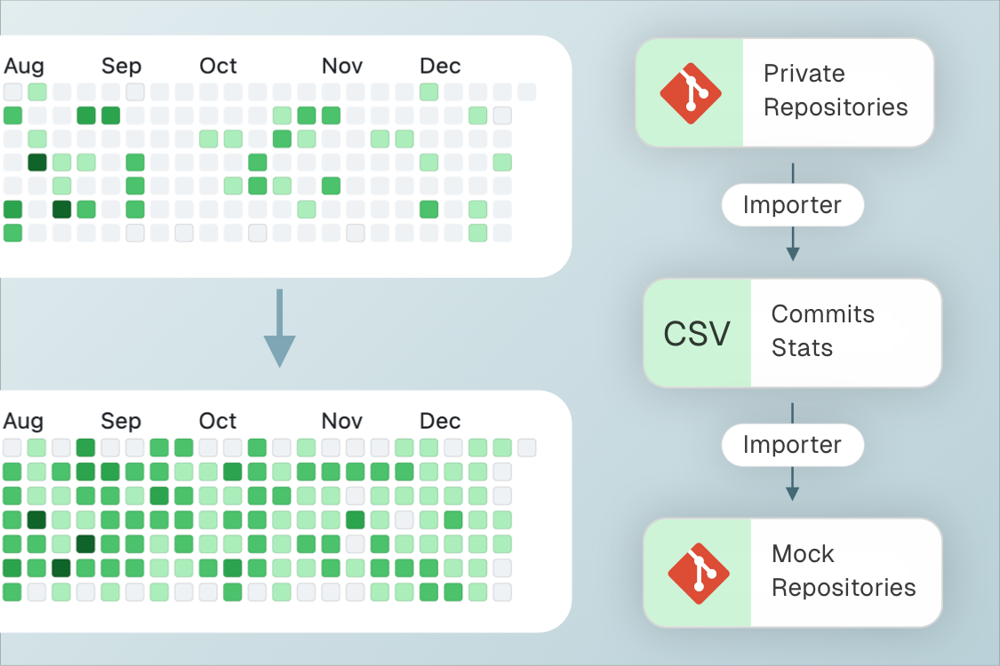

# Contributions
This tool allows you to import and display contributions to private projects without copying the actual code into a single project with a contribution mockup. It has been modified for macOS based on the [original](https://github.com/miromannino/Contributions-Importer-For-Github)

<picture>
  <source media="(prefers-color-scheme: dark)" srcset="Image.webp">
  <source media="(prefers-color-scheme: light)" srcset="Image.webp">
  
</picture>

## Installation Instructions
### Install Homebrew
```bash
/bin/bash -c "$(curl -fsSL https://raw.githubusercontent.com/Homebrew/install/HEAD/install.sh)"
```
### Install Python
```bash
brew install python
python3 --version
pip3 --version
```
### ### Install Git
```bash
brew install git
git --version
```

### ### Install GitPython
`# Virtual environment: Create, Activate, Install, Verify
```bash
python3 -m venv venv
source venv/bin/activate
pip install gitpython
python -c "import git; print('GitPython installed successfully!')"
```
`# When finished, deactivate the environment and remove the environment folder`
```bash
deactivate
rm venv
```

## Working with the Import
1. Install GitPython via a virtual environment
```bash
python3 -m venv venv
source venv/bin/activate
pip install gitpython
python -c "import git; print('GitPython installed successfully!')"
```
2. Set the path to the folder containing the import scripts `Importer` at its root, and the launch script  `RunImport.py`
3. Specify the paths to the folders of private projects where git is located `repo1 = git.Repo("Path/PrivateProject1/.git")` and list them in the array `importer = ImporterFromRepository([repo1, repo2], mock_repo)`
4. Specify the path to the empty git repository used to store the contribution `mock_repo = git.Repo("Path/MockProjects/.git")`. If git has not been initialized, run the command
```bash
git init
```
5. Specify the emails to capture selected commits from `importer.set_author(['work@email.ru', 'personal@email.ru'])`
6. Run the contribution import script
```bash
python RunImport.py
```
7. Deactivate the virtual environment and remove the folder
```bash
deactivate
rm venv
```

## Notes
All commands are executed in the terminal.
Use python3 and pip3 instead of python/pip to avoid conflicts with older Python versions.
If permission errors occur
```bash
pip3 install --user gitpython
```


